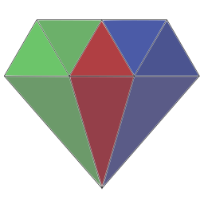

# Genstone
*A C Application Framework*

Genstone is a set of C utilities intended to be more modern and friendly than the standard library and also go further in terms of features.

Genstone is a similar kind of library to the likes of SDL (though smaller and with some major design differences due to differing goals).

At the time of writing Genstone is only used for one application - https://github.com/Th3T3chn0G1t/Cionom - however Genstone could be used for all manner of libraries or applications provided they stand to benefit from Genstone's featureset. This currently refers to:

- A sturdier error handling and backpropogation (or bubbling) system
- An argument parser
- Dynamic library utilities
- File stream/path utilities
- Filewatching
- Contextual logging
- Memory utilities
- String utilities
- Threading utilities
- Debug tooling (backtrace generation without debug info)
